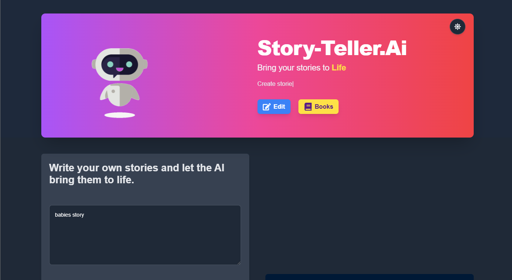
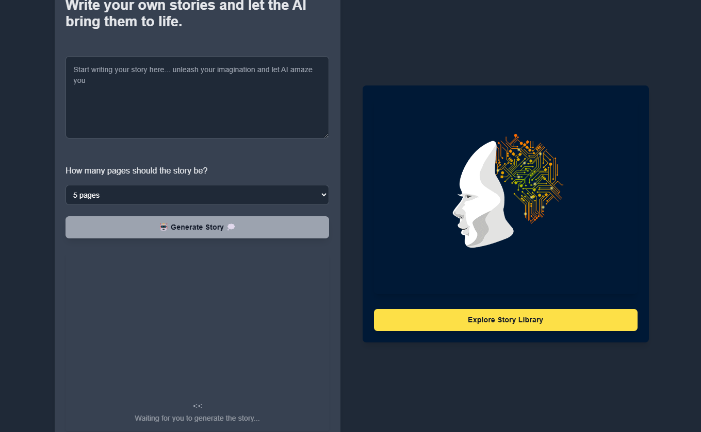
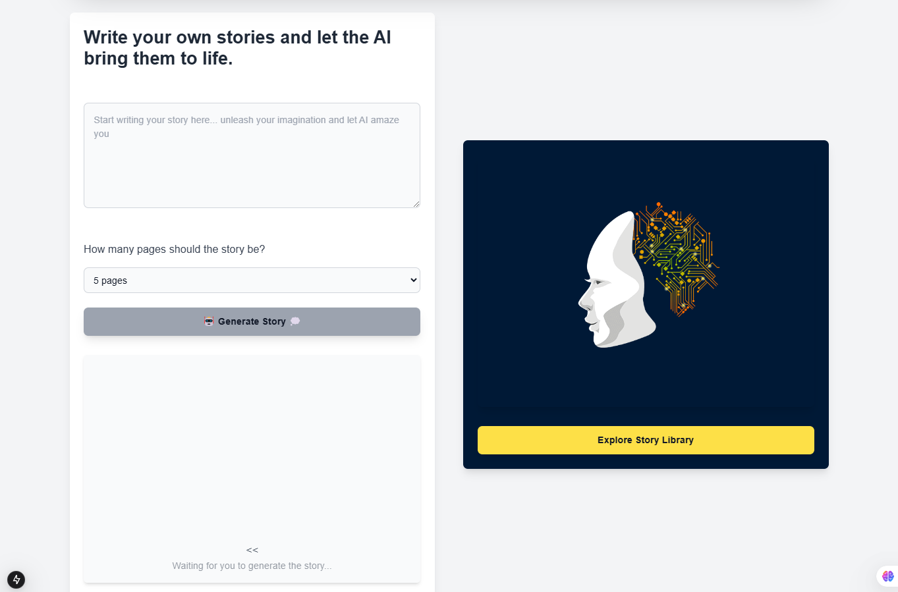

the app work perfectly fine and working but its need api key from the paid version so its need the model named gpt-4o that comes from the paid plan from the open
ai platform https://platform.openai.com/

# api-keys
https://platform.openai.com/settings/organization/api-keys

# api limit
https://platform.openai.com/settings/proj_P6jSSoHJqOzjSSPfe5qLwill/limits

create env.local file

OPEN_AI_API_KEY= your api key here

src tutor 1:50:00
https://www.youtube.com/live/8_usygEhn4k